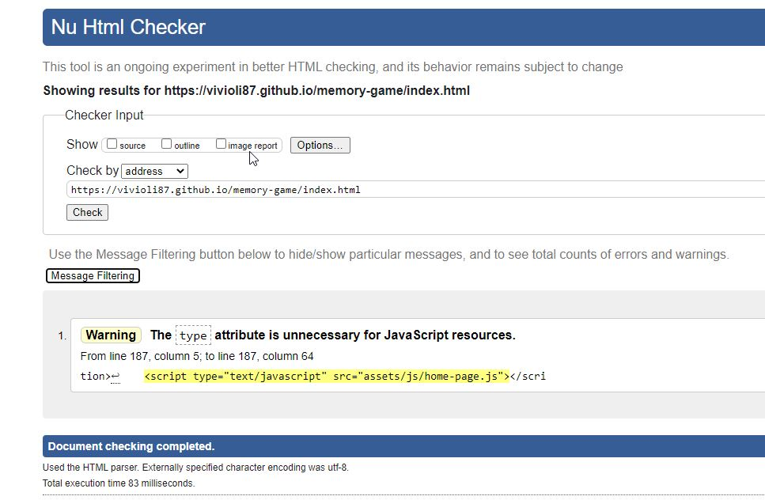
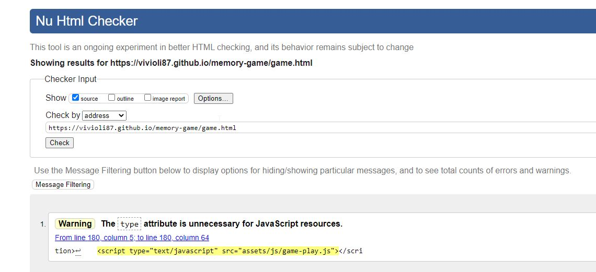
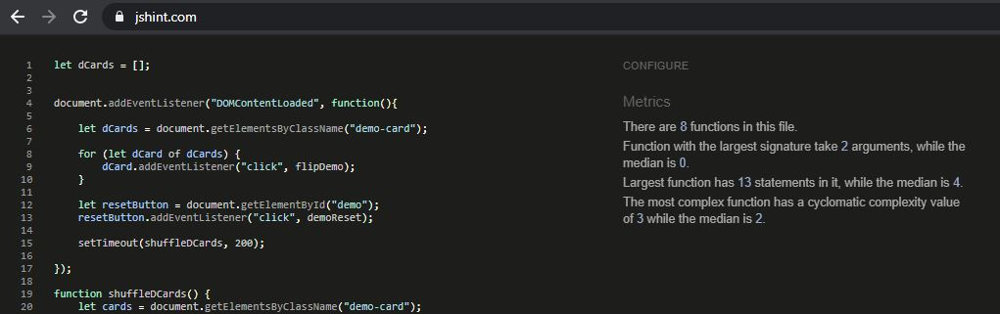
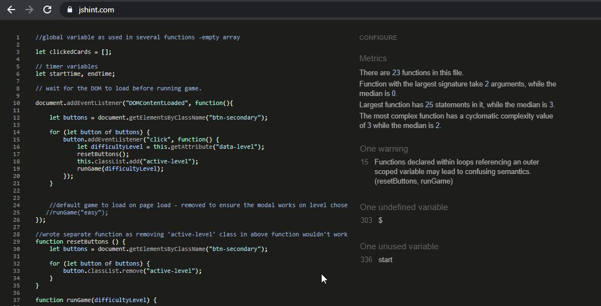
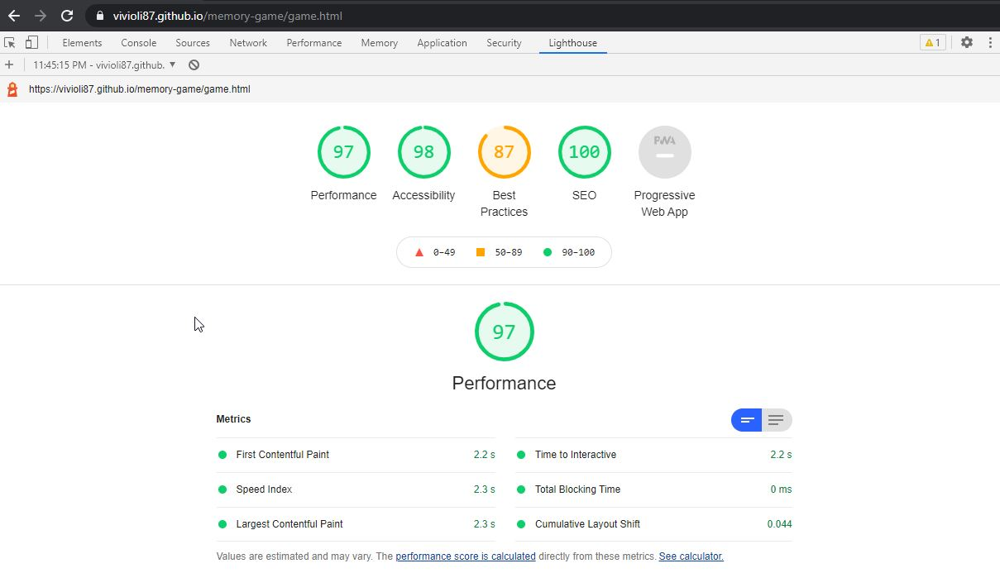
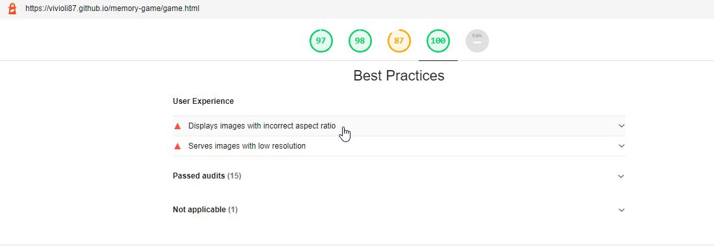

# Succulent Match - A memory game (Testing section)

[Main README.md file](https://github.com/Vivioli87/memory-game/blob/master/README.md)  

[Please view the live project here](https://vivioli87.github.io/memory-game/)

## Table of contents

1. [User Stories Testing](#user-stories-testing)
2. [Code Validation](#code-validation)
3. [Functionality Testing](#functionality-testing)
4. [Performance Testing](#performance-testing)
5. [Encountered Issues](#encountered-issues)

## User Stories Testing

### Visitor Stories

1. As a site visitor, I would like to have fun playing a simple memory game.
    - The memory game is simple to use and is clearly set out how to play within the game instructions section on the home page.
    - The game has different difficulties to provide more challenging scenarios and has game statistics to allow the user to compete with themselves.
    - When each game is succussfully completed there is an applause sound to congratulate the user for finishing the level.
    - The website is clearly laid out to allow the user to navigate around the site with ease.
2. As a site visitor, I would like to have a brief overview of the rules before playing.
    - On the landing page, there is a game instructions section which outlines the rules of the game. 
    - There is also a small tutorial/demo to allow the user to get used to the game and how to interact with it before playing a full game.
3. As a site visitor, I would like to be able to try a tutorial or demo before attempting a real game.
    - As above, as part of the game instructions section on the landing page there is a small tutorial/demo to allow the user to get used to the game and how to interact with it before playing a full game. 
    - The tutorial can be easily re-set with the re-set button if the user wants more practice time.
4. As a site visitor, I would like to be able to play different levels.
    - On the game page the user can choose between easy, medium and hard difficulty levels. Easy has 12 cards (6 pairs), Medium has 16 cards (8 pairs), Hard has 20 cards (10 pairs).
    - The user can switch between levels easily at any time.
5. As a site visitor, I would like to be able to see how long each game took, how many moves were made and how accurate I was.
    - During the game there is a game information section below the game area which updates the number of moves, number of correct and incorrect matches and the accuracy of the users moves.
    - The game is timed from when the user clicks the start button until all the cards are matched.
    - Once the game has been finished a message pops up with the time the user took to completed in seconds. This message also provides the number of moves and accuracy stats also.
    - If a new game is started before the previous game has finished the scores are re-set ready for the new game.
6. As a site visitor, I would like an option to learn more about the subject matter of the game: Succulents.
    - On the landing page, there is a section at the bottom which provides the users some resources on what succulents are, how to care for them and where to buy them also.
    - Through playing the game, the user can see and appreciate the various succulent types and colours that exist.
7. As a site visitor, I would like a the game website to be easily navigable and have sleek design, that is responsive on different devices.
    - The website is fully responsive for different devices.
    - There is a navigation bar at the top of each page to allow users to access any page of the website at any time.
    - There is a button within the game instructions section on the home page, which takes the user to the game page when they are ready to play also.
    - Any external links are opened on a new tab so that the user isn't completely navigated away from the website.
8. As a site visitor, I want the imagery and colors to be eye-catching that make me want to learn more about succulent plants.
    - The main colour used for the site is purple, in 2 contrasting shades. A darker purple for text, headings, links, borders and buttons to contrast against the softer pastel purple used for the backgrounds.
    - I also used a background image of succulents to show through the pastel, opaque purple to keep the succulent theme going through the website.
    - The same image used for the background was also used for the back of the cards.
    - For the differenct succulent cards, i tried to find images that are eyecatching in their own way, that aren't too similar in colour and that convey how many varieties of succulents you can find.
9. As a site visitor, I would like to be able to view the top scores/scorers on each level.
    - Not implemented for this deployment due to time and knowledge level, however is something that would be implemented for future deployments.
10. As a site visitor, I would like to log my top score with my name if I beat any 'top scores'.
    - Not implemented for this deployment due to time and knowledge level, however is something that would be implemented for future deployments.

### Business Stories

1. As a site owner, I have the same goals as the external users. I would like to make a game that I would enjoy playing.
    - The memory game is simple to use and is clearly set out how to play within the game instructions section on the home page.
    - The game has different difficulties to provide more challenging scenarios and has game statistics to allow the user to compete with themselves.
    - When each game is succussfully completed there is an applause sound to congratulate the user for finishing the level.
    - The website is clearly laid out to allow the user to navigate around the site with ease.
2. As a site owner, I would like to make the game instructions simple to follow.
    - The game instructions section is clear and concise, with the aim of the game clearly defined.
    - There is a tutorial/demo version of the game to get the user used to how to play and the interactivity with the cards before playing for real.
3. As a site owner, I would like to make the game logical to follow and interact with, even without reading the instructions prior.
    - All links, buttons, and interactive elements (such as the game cards) have a pointer cursor when they are hovered over to prompt the user to click.
    - The game cards can only be clicked in pairs, the cards are locked so a third cannot be clicked before the game can check if they match.
    - The same game card can also not be clicked more than once in a move either.
    - When the user finds a matching pair these are hidden to take them 'out of the game'.
    - The game is generally simple to figure out and interact with without reading any instructions.
3. As a site owner, I would like to provide a lot of interactivity within the game to provide information regarding the time taken, number of moves etc in order to produce 'top scores' and to provide a competitive element to the game.
    - Under the game area, there is a section which gives in game feedback to the user on how many moves they have made, how many correct and incorrect matches they have made and how accurate they have been.
    - There is a hidden timer for the game also and the user finds out how long they took to complete the game in the finishing message.
    - The top scores section will be a future implentation to the site as discussed in previous parts of this readme document.
4. As a site owner, I would like to share my passion for succulent plants as well as advice (separate to the game) on how to care for them.
    - At the bottom of the home page I have included a section with online references on succulents: what they are, how to care for them and where to buy them.
    - In the about the game section on the home page, I have talked about why I chose succulents as the theme of my game which will show my passion and hopefully spark the user's interest in them also.
5. As a site owner, I would like to provide a google map service so users can look up their local garden centre/succulent stockist.
    - Not implemented for this deployment due to time and prioritising other aspects of the website, however is something that would be implemented for future deployments.
    - However I have made reference to where users can buy/find succulents and also provided some links to buy them online.

[Back to table of contents](#table-of-contents)

## Code Validation

Every page of the project was validated by the [W3C Markup Validation Service](https://validator.w3.org/#validate_by_input) to ensure there were no syntax errors or issues.
[W3C CSS Validation Service](https://jigsaw.w3.org/css-validator/#validate_by_input) was used to validate CSS code and [jshint.com](https://jshint.com/) was used to check JS code.

### W3C Markup Validation Service

Checked using both validate by direct input and validate by URI options.

#### Home page

JavaScript script link warning.

#### Game page

Initally there was an error with the arialabelledby attribute for the bootstrap modal used where the modal title id had been deleted in error.

Same JavaScript script link warning.

### W3C CSS Validation Service

### jshint.com

When using jshint ensue to enable the "New JavaScript features (ES6)" in the configure tab. 

I have previously used jshint and fixed any missing or unneccessary semi colon issues.

#### Home Page

No errors/warnings.

#### Game Page

line 303 - undefined variable $ is a jquery line of code. Not altered as it completes the task required of it.
line 336 -unused variable. the start function is called from the html file on this instance only for ease. It is in use so have not altered this either.

[Back to table of contents](#table-of-contents)

## Functionality Testing

- Feature testing on each page in turn and for all screen sizes using the developer tools, my own personal devices and got friends/family to test also.
    - Checked that all links navigate correctly and that none are broken.
    - Checked the responsive layout worked as intented, using both chrome developer tools and my own personal devices.
    - Checked that the game play and javascript functions worked as expected. Functions such as:
        - Correct levels loaded when button clicked.
        - Flip card events.
        - Checking pairs match, including what to do if match/don't match.
        - only allowing 2 unique cards to be clicked in the one 'move'
        - what happens at the end of the game
        - game information updating or re-setting.
    - Checked that all elements that have a 'hover' attribute to them such as links, cards and buttons respond correctly.

### Browser Testing

The website was tested on the following browser types. All browser versions were up to date.
- **Google chrome** - best performance with all cookies allowed.
- firefox
- Safari
- Samsung Internet
- Google chrome for Android   

The website is functioning and fully responsive on all above mentioned browsers.

### Device Testing

For all my media queries, I used the following page for help on [standard device sizes](https://css-tricks.com/snippets/css/media-queries-for-standard-devices/)

The website was tested on the following devices:
- desktop computer
- Samsung Galaxy A70

The site has been tested on friend's devices also. These include:
- Macbook pro
- Samsung S8 / S21
- iphone 7 / 11 / 12 / XR
- Google3
- Samsung tablet.

I have tested other devices using the chrome developer tools including:
- Moto G4
- Galaxy S5
- Pixel 2 / Pixel 2 XL
- iPhone 5 / SE / 6 / 7 / 8 (incl Plus options) / X
- iPad / iPad Pro
- Surface duo
- Laptop

The website is platform-cross compatible and has a consistant result. However as noted on the main README doc, for the best game experience (especially on hard level) larger device sizes are recommended to be able to view all cards in the game.

[Back to table of contents](#table-of-contents)

## Performance Testing

Using lighthouse on Google Chrome developer tools - reports generated 

#### Home page

#### Game page

### Issues highlighted from Lighthouse reports and fixed.

- issues with image sizes and formats in performance section.
- meta descriptions missing for pages.
- external links not having rel="noopener" for security reasons

[Back to table of contents](#table-of-contents)

## Encountered Issues

- During testing phase, my friends with iPhones reported a glitch when the cards flipped which would show half the back and half the front momentarily. This was an issue I had been unaware of due to not using apple products or the safari web browser. After playing around with the transormY css attributes for the game-card, card-front and card-back classes I found a fix that worked on both android and apple products.

[Back to table of contents](#table-of-contents)
